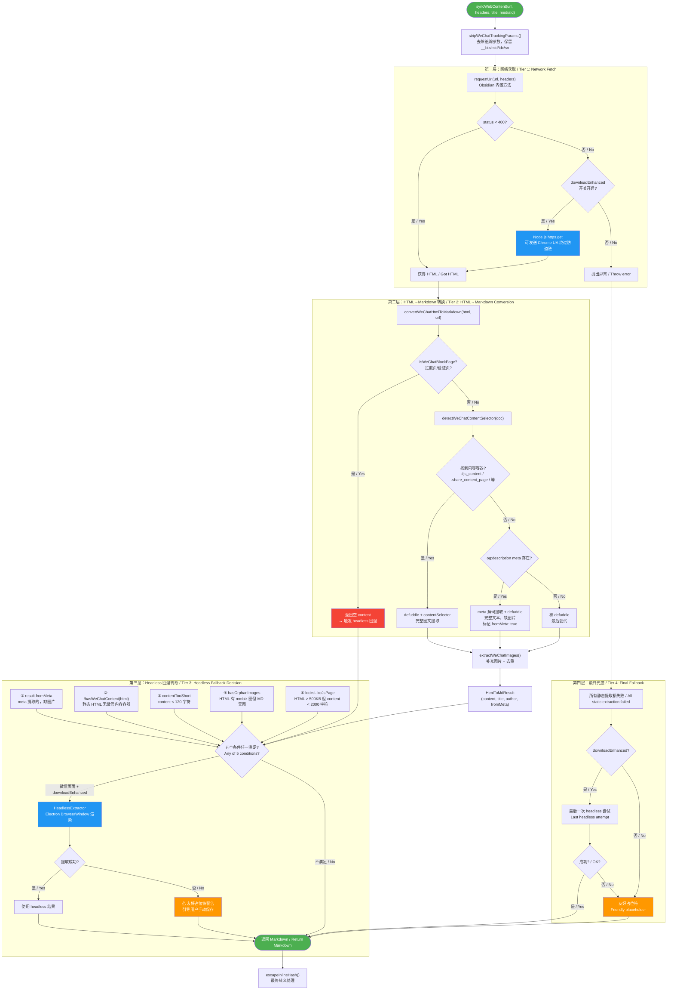
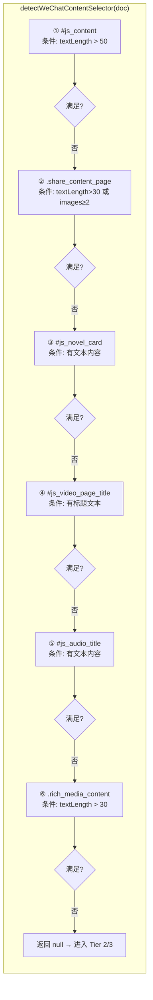

# 微信公众号文章获取流程图 / WeChat Article Fetching Flow

## 总览 / Overview



## 内容容器检测优先级 / Content Container Detection Priority



## 图片补充逻辑 / Image Supplement Logic

```mermaid
flowchart TD
    IMG["extractWeChatImages(html, doc, existingMd)"] --> COLLECT

    subgraph COLLECT["四路收集 / Four Collection Paths"]
        direction TB
        S1["① DOM img 标签<br/>data-src 或 src<br/>过滤: from=appmsg 正文图<br/>去重: 已存在的 MD 图片"]
        S2["② cdn_url JS 变量<br/>正则: cdn_url: '...from=appmsg...'<br/>轮播中隐藏的图不在 DOM"]
        S3["③ data-src 属性模式<br/>正则: data-src='...mmbiz/qpic...jpg/png/...'<br/>](https://过滤系统资源)
        S4["去重策略 / Dedup<br/>① 已存在 MD 中的图片 URL<br/>② normalizeImgUrl: 去查询参数 + 统一子域名"]
    end
```

## 关键文件映射 / Key File Mapping

| 文件 | 职责 |
|------|------|
| [src/sync-manager.ts](src/sync-manager.ts) `syncWebContent()` | 主流程编排：网络获取 → 转换 → headless 判断 → 兜底 |
| [src/html-to-md.ts](src/html-to-md.ts) `convertWeChatHtmlToMarkdown()` | HTML→MD 三层回退 + 图片补充 |
| [src/html-to-md.ts](src/html-to-md.ts) `detectWeChatContentSelector()` | 内容容器检测 |
| [src/html-to-md.ts](src/html-to-md.ts) `extractWeChatImages()` | 图片补充提取 |
| [src/headless-extractor.ts](src/headless-extractor.ts) | Electron BrowserWindow 无头提取 |
| [src/file-downloader.ts](src/file-downloader.ts) `downloadWithAntiHotlink()` | requestUrl → https.get 双层下载 |
| [src/file-downloader.ts](src/file-downloader.ts) `fetchHtmlViaNodeHttps()` | Node.js https 获取 HTML（桌面端兜底） |

## 核心判断逻辑总结 / Core Decision Logic

```
判断依据（按优先级）：
  1. 网络层 → downloadEnhanced 开关
  2. 解析层 → 静态 HTML 中内容容器 / meta 的存在性
  3. 质量层 → 内容长度、图片丢失、JS 渲染特征
  4. 兜底层 → 以上全部失败

不根据文章类型（小绿书/文章/图文）来判断。
Does NOT decide based on article type (小绿书/text-image/图文).
```
